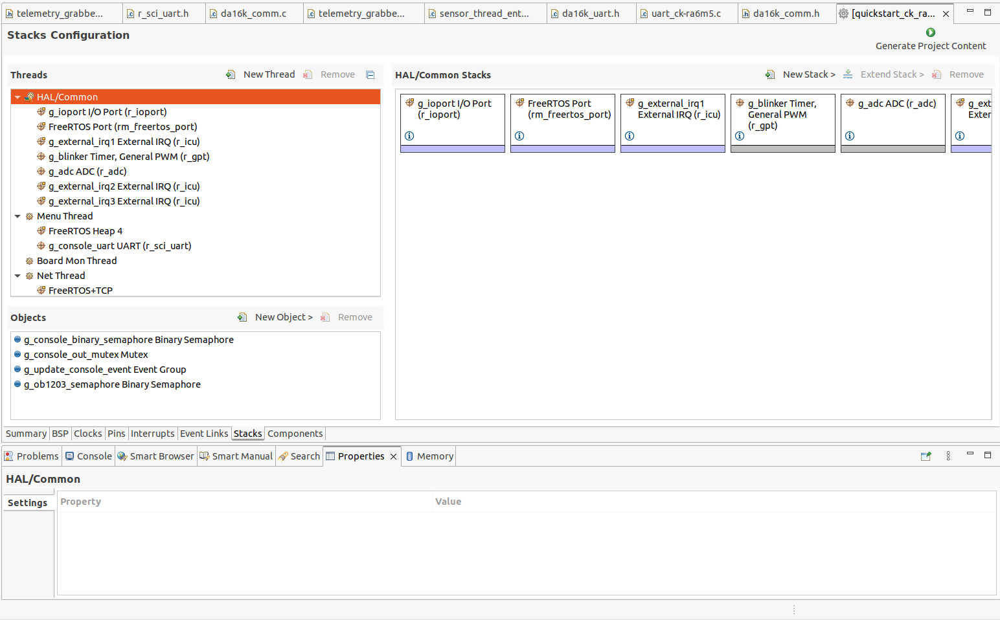
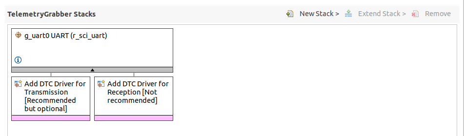
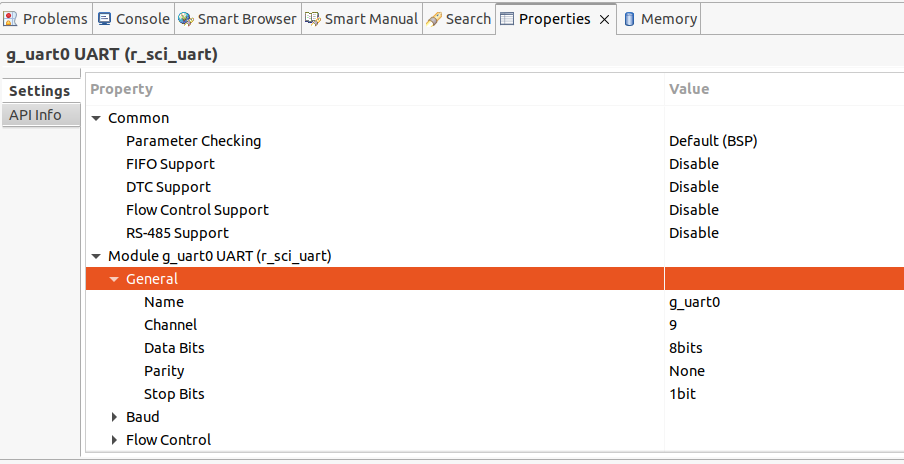
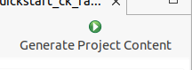

# IoTConnect AT Command Client Interface Code for FreeRTOS
# This repository is currently in proof-of-concept state.

This repository contains code that uses the AT command interface provided by the IoTConnect DA16K SDK to communicate with an Azure IoTConnect environment.

## Currently supported MCU Client platforms

* Renesas CK-RA6M5 v2 Cloud Kit (PMOD connector)
    * Demo project: https://github.com/avnet-iotconnect/iotc-freertos-CK-RA6M5-V2-PMOD

## Setup on a new or existing project

### Step 1: Set up Dialog 16200/16600 Device with IoTConnect

Obtain or build the images for your Dialog 16200/16600-based device via the [IoTConnect Dialog 16K SDK repository](https://github.com/avnet-iotconnect/iotc-dialog-da16k-sdk).

Boot and configure it as per the [Quickstart guide](https://github.com/avnet-iotconnect/iotc-dialog-da16k-sdk/blob/main/doc/QUICKSTART.md):

* WiFi connectivity
* X509 certificates
* IoTConnect configuration

### Step 2: Connect target MCU hardware to Dialog 16200/16600

For example: Connecting a DA16K PMOD device to the appropriate port on a Renesas Cloud Kit (e.g. CK-RA6M5)

### Step 3: Add this code to your project

It is portable code that should compile and run out of the box, without any modifications.

## Usage

Using this code is aimed to be as straight-forward as possible:

* Call `da16k_init` with an empty `da16k_cfg` structure.

    At the moment, there are no configurable parameters.

* Start communicating with IoTConnect by using the `da16k_send_<x>` functions for your appropriate data type.

    These take attribute names (`key`) - as defined in your IoTConnect device template - and an associated value to be sent to IoTConnect.

* Call `da16k_deinit` once you are finished.

### Functions for sending data and supported types

These are declared in `da16k_comm.h`.

| Function              | Parameter        | IoTConnect Type |
|-----------------------|------------------|-----------------|
| `da16k_send_str`      | `const char*`    | STRING          |
| `da16k_send_float`    | `double`         | DECIMAL         |
| `da16k_send_uint`     | `uint64_t`       | INTEGER         |
| `da16k_send_int`      | `int64_t`        | INTEGER         |
| `da16k_send_bool`     | `bool`           | BOOLEAN         |

### Error handling

The functions return descriptive error codes. Please see the `da16k_err_t` enum in `da16k_comm.h` for details.

## Usage example: Renesas CK-RA6M5 v2 with e² Studio IDE

Imagining a scenario with an existing project (e.g. the Quickstart sample project from Renesas, `quickstart_ck_ra6m5_v2_ep`) on the CK-RA6M5 v2 development board, we wish to connect a Dialog 16600 PMOD module to the **PMOD1** connector and communicate with it. 

Proceed as follows.

### Project configuration

* Open the **Stacks Configuration** window by double clicking on `configuration.xml`.



* Create a new Task using the **New Thread** button. 

    Give the thread a descriptive name, for example `TelemetryGrabber`.

* On the **Stacks** pane, add a new UART by clicking **New Stack**, **Connectivity**, and **UART (r_sci_uart)**



* Using the **Properties** tab, chonfigure the stack to use the UART channel required for the chosen connector. For PMOD1, this is Channel **9**.



* Finish by clicking **Generate Project Content**.



* Add this repository to the `src` directory of the project.


### Implementation

e² studio has generated the necessary files for the new thread. 

* Navigate to `telemetry_grabber_entry.c`, and start adding the necessary code to the `telemetry_grabber_entry` function.

* Call `da16k_init`.

* Extend the task with a loop that aggregates all the telemetry attributes in a fixed time window.

* Whenever the data is aggregated, send the attributes using the appropriate `da16k_send_x` functions.

```c
void telemetry_grabber_entry(void *pvParameters)
{
    FSP_PARAMETER_NOT_USED (pvParameters);

    da16k_cfg_t da16kConfig;

    st_sensor_data_t previousSensorData = {0};
    st_sensor_data_t newSensorData = {0};

    da16k_err_t err = da16k_init(&da16kConfig);

    assert(err == DA16K_SUCCESS);

    while (1)
    {
        /* obtain sensor data */
        sensor_thread_get_status(&newSensorData);

        /* Renesas HS3001 */

        da16k_send_float("hs3001_humidity",    hs300xDataToFloat(&newSensorData.hs300x.hs300x_data.humidity));
        da16k_send_float("hs3001_temperature", hs300xDataToFloat(&newSensorData.hs300x.hs300x_data.temperature));
        (...)
    }
}
```

* You now have a functional project that can send telemetry data to IoTConnect using the Dialog 16K module.

## Usage with unsupported MCU platform

If you wish to use this code with another platform, it is only necessary to implement a C file with the following basic functions for communicating via UART, declared in `da16k_uart.h`, and link it.

* `da16k_uart_init`

    Initialize the UART interface for your platform with the given parameters (baud rate, stop bits, bits per byte, parity)

* `da16k_uart_read`

    Reads a specified amount of bytes into a buffer.
    
    Returns **false** in case of a time-out, which is arbitrary but should be around 500 milliseconds.

* `da16k_uart_write`

    Writes a specified amount of bytes from the buffer into the UART.

    Returns **false** in case of a failure.

* `da16k_uart_close`

    Uninitializes the UART interface for your platform.

# Limitations

The AT Command Protocol theoretically is able to asynchronously inform the client of changes in connection state, received commands or OTA requests.

Handling these properly asynchronously in a platform-agnostic way is not possible without considerable effort and client specific code.

Since this library focuses on maximum ease of use and ease of implementation, therefore, these functions are not supported.
